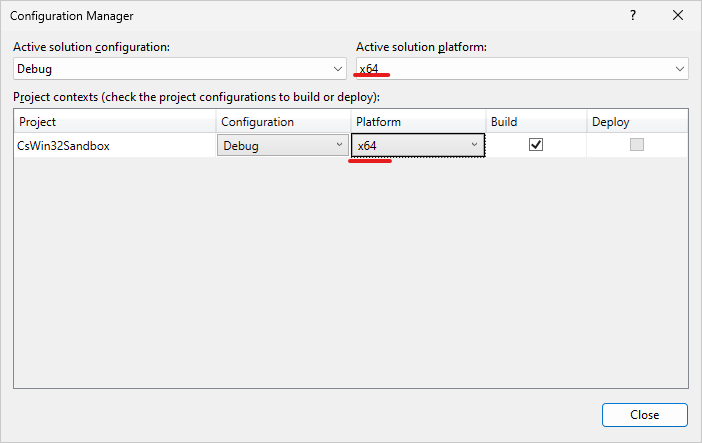

# Architecture-specific APIs

Most Win32 APIs can be represented with the same C# code for any CPU architecture.
Such APIs can be generated in a C# project that targets AnyCPU.

But some Win32 APIs vary by CPU architecture, and a few APIs are available exclusively to a subset of architectures.
For CsWin32 to generate these arch-specific APIs, your project must target a specific CPU architecture.

If your NativeMethods.txt file contains an arch-specific API, an AnyCPU compilation of your project will produce this warning:

> warning PInvoke005: This API is only available when targeting a specific CPU architecture. AnyCPU cannot generate this API.

Note that Visual Studio may only show this warning when you actually *build* the project.

When your NativeMethods.txt file contains an API wildcard (e.g. `Kernel32.*`), only APIs compatible with your selected architecture will be generated.
In particular, if your project targets AnyCPU, only APIs that are compatible across all architectures will be generated.
No warnings will be emitted when wildcard generation leaves some APIs out.

Note that some APIs may not be arch-specific in and of themselves, but may depend on other arch-specific APIs.
For example, the `VirtualQuery` method itself doesn't vary across architectures, but it takes a `MEMORY_BASIC_INFORMATION` struct as a parameter, and that struct *does* vary by architecture.
This makes declaring the method itself impossible because we cannot declare the struct necessary to do so.

## Adding architecture-specific APIs

To generate arch-specific APIs, target your C# compilation to a specific architecture.

### Targeting *one* specific architecture

One very simple way to do this is add this property to your .csproj project file:

```xml
<PlatformTarget>x64<PlatformTarget>
```

This will effectively produce an x64-specific assembly.
It will not be an AnyCPU assembly anymore and will not load in any process other than an x64 process.
This is true even if the project and/or solution platform in Visual Studio show "Any CPU" as the selection.
Which leads us to our more complete example of how to make this work for more architectures.

### Targeting multiple specific architectures

Your .csproj project can target many architectures at once by producing one assembly (.dll) for each architecture you intend to support.

Visual Studio for Windows makes this fairly automatic via the configuration manager, with these steps:

1. Invoke the Configuration Manager (Build menu->Configuration Manager command).
1. Under "Active solution platform", notice which platforms already are defined. Commonly this will list just "Any CPU".
1. If an architecture you want to target does not appear in the solution platforms list:
   1. Click the `<New...>` item from the solution platform dropdown list.
   1. Select the platform you would like to add. For example, `x64`.
   1. Uncheck the "Create new project platforms" box if you don't want to multitarget for *all* projects in the solution.
   1. Click OK.
1. With the "active solution platform" set to the CPU architecture you want to target, check the project grid below and verify that the project's own Platform dropdown is set to match the CPU architecture. If the platform you want isn't listed, you may need to select `<New...>` and create it.

When you're done, it should look something like this:



You can repeat this process for each target architecture you want to support.

Now in Visual Studio, you can use the active solution platform switcher in the Standard toolbar to control which platform you are targeting, as shown:


CsWin32 will now generate arch-specific APIs in each non-AnyCPU platform of your project.

## FAQs

You can learn more about this in the FAQs below, or by [searching our github issues list for "AnyCPU"](https://github.com/microsoft/CsWin32/issues?q=is%3Aissue+anycpu).

### Why can't we just emit more APIs in AnyCPU?

When you only compile for AnyCPU, the built assembly is expected to run correctly in a process of any architecture (e.g. x86, x64, arm, arm64).
This means the struct interop types must accurately represent the memory layout equivalent to what Win32 is expecting.
When a single C# declaration of a struct can be interpreted by the runtime correctly on every architecture, an AnyCPU target is possible.
But if anything has to change on a declaration depending on the architecture, even something as benign-looking as a `[Struct(Pack=1)]` attribute, we have to generate the one that matches one specific architecture. This makes AnyCPU targets that use that struct prohibitive.

### How do we build a nuget package with arch-specific assemblies?

NuGet packages can represent assemblies that are architecture-specific.
These packages can even offer an AnyCPU reference assembly so that your users can target AnyCPU themselves even though they depend on your assembly, which at runtime must be architecture-specific.

C# self-packing projects do not have built-in support for multiple platforms or an AnyCPU ref assembly beside the arch-specific ones.
Constructing such a package for your project will require a great deal of custom build authoring and is (for now, at least) beyond the scope of this document.
